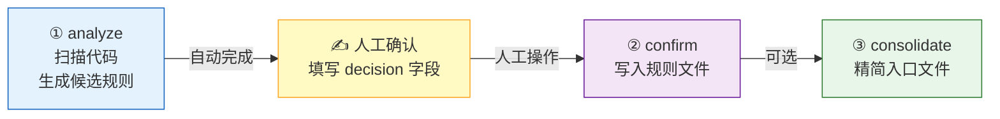
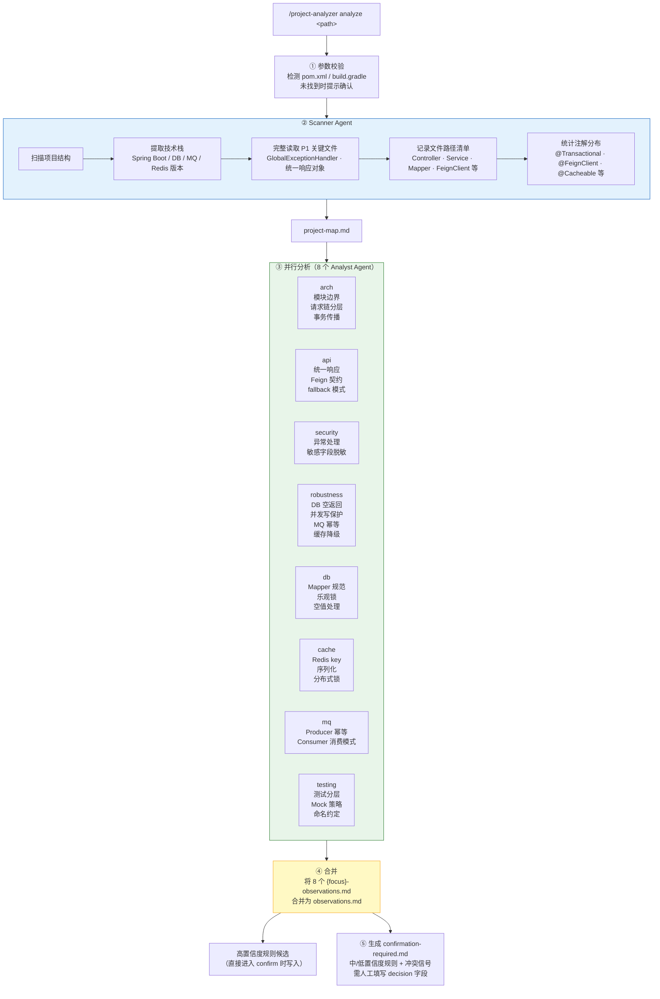
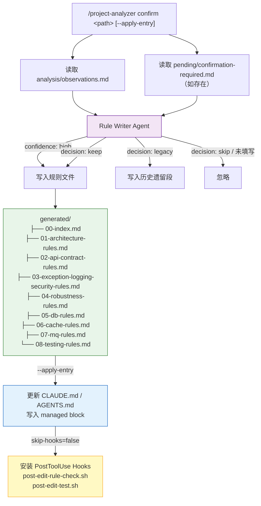
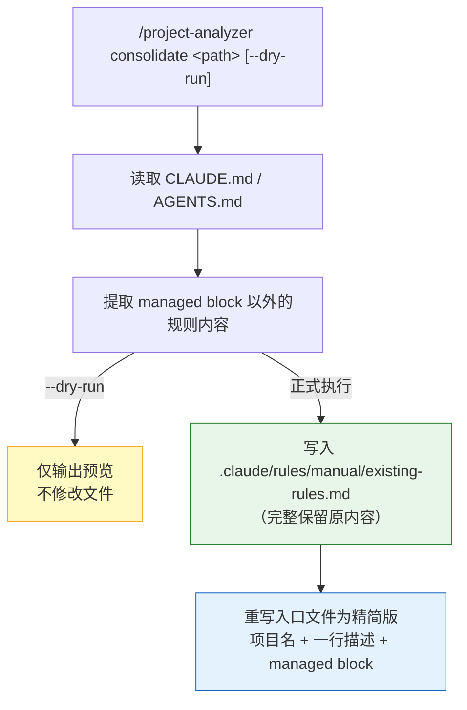

# Project Analyzer

面向 Java 微服务项目的本地 AI 编码规则生成工具。通过静态代码分析，提取项目特有的编码约束，让 AI 在写代码前加载项目规则。

**成功标准**：AI 按规则写出的代码，团队成员认为在模块位置、API 契约、异常日志、健壮性四个方面符合项目风格。

## 快速开始

```
# 第一步：分析项目（生成候选规则）
/project-analyzer analyze /path/to/java-service

# 第二步：编辑确认文件，填写 decision 字段（keep / skip / legacy）
# 文件位置：{project_path}/.claude/rules/pending/confirmation-required.md

# 第三步：生成规则文件
/project-analyzer confirm /path/to/java-service --apply-entry

# 可选：精简 CLAUDE.md / AGENTS.md（内容较多时）
/project-analyzer consolidate /path/to/java-service
```

## 执行流程

### 整体三阶段流程



---

### analyze — 扫描与分析

执行 `/project-analyzer analyze <path>` 后，内部分五步完成：



**步骤说明**：

| 步骤 | 产出文件 | 说明 |
|------|---------|------|
| ① 参数校验 | — | 验证是否是 Java 项目 |
| ② Scanner | `analysis/project-map.md` | 文件地图 + 技术栈，供后续 Analyst 使用 |
| ③ 并行分析 | `analysis/{focus}-observations.md` × 8 | 每个维度独立读代码，判断置信度 |
| ④ 合并 | `analysis/observations.md` | 汇总所有观察，作为 confirm 的输入 |
| ⑤ 确认清单 | `pending/confirmation-required.md` | 需人工决策的中/低置信度条目 |

---

### confirm — 写入规则文件

执行 `/project-analyzer confirm <path> [--apply-entry]` 后：



**decision 字段说明**：

| 值 | 含义 |
|----|------|
| `keep` | 确认为项目规范，写入规则文件 |
| `skip` | 不是规范，忽略 |
| `legacy` | 历史遗留写法，写入历史遗留段供参考 |
| 未填写 | 等同 skip |

---

### consolidate — 精简入口文件

适用场景：`CLAUDE.md` / `AGENTS.md` 内容较多，或 `confirm --apply-entry` 多次后文件膨胀。



## 三子命令参数

| 子命令 | 参数 | 必填 | 默认值 | 说明 |
|--------|------|------|--------|------|
| analyze | `project_path` | 是 | — | Java 服务目录 |
| analyze | `--focus` | 否 | `all` | `arch` / `api` / `security` / `robustness` / `db` / `cache` / `mq` / `testing` / `all` |
| confirm | `project_path` | 是 | — | Java 服务目录 |
| confirm | `--apply-entry` | 否 | false | 同时将 managed block 写入 CLAUDE.md / AGENTS.md |
| confirm | `--skip-hooks` | 否 | false | 跳过 PostToolUse Hook 安装（仅当 --apply-entry 为 true 时生效） |
| consolidate | `project_path` | 是 | — | Java 服务目录 |
| consolidate | `--dry-run` | 否 | false | 仅预览变更，不写文件 |

## 八维度分析

| focus | 关注点 |
|-------|-------|
| `arch` | 模块边界、请求链分层、跨层调用、事务传播边界 |
| `api` | 统一响应对象、FeignClient 契约、fallback 模式 |
| `security` | 异常处理边界、敏感字段脱敏、日志安全 |
| `robustness` | Feign 降级、DB 空返回、并发写保护、MQ ACK、缓存降级 |
| `db` | Mapper 规范、空值处理、乐观锁、批量操作 |
| `cache` | Redis key 规范、序列化、缓存注解、分布式锁 |
| `mq` | Consumer 幂等、ACK 时机、消息体设计、Producer 重试 |
| `testing` | 测试分层、Mock 策略、命名约定；无测试时生成默认 TDD 原则 |

`--focus=all`（默认）时并行分析所有 8 个维度。

## 输出结构

```
{project_path}/.claude/rules/
├── analysis/                       # analyze 产物
│   ├── project-map.md              # 项目文件地图（scanner 产出）
│   ├── arch-observations.md        # arch 维度观察
│   ├── api-observations.md         # api 维度观察
│   ├── security-observations.md
│   ├── robustness-observations.md
│   ├── db-observations.md
│   ├── cache-observations.md
│   ├── mq-observations.md
│   ├── testing-observations.md
│   └── observations.md             # 合并后全量观察（confirm 的输入）
├── pending/
│   └── confirmation-required.md   # 待确认清单（人工填写 decision 字段）
├── generated/                      # confirm 后生成（全量重写）
│   ├── 00-index.md                 # 任务类型 → 规则文件路由表（AI 先读）
│   ├── 01-architecture-rules.md
│   ├── 02-api-contract-rules.md
│   ├── 03-exception-logging-security-rules.md
│   ├── 04-robustness-rules.md      # 有规则时创建
│   ├── 05-db-rules.md              # 有规则时创建
│   ├── 06-cache-rules.md           # 有规则时创建
│   ├── 07-mq-rules.md              # 有规则时创建
│   └── 08-testing-rules.md         # 有规则时创建
└── manual/                         # 人工补充（Analyzer 不修改）
```

## 自动化 Hook

`confirm --apply-entry` 完成后，默认会安装两个 PostToolUse Hook，在每次编辑 Java 文件时自动触发：

| Hook 脚本 | 触发条件 | 执行 Agent |
|-----------|---------|-----------|
| `post-edit-rule-check.sh` | Edit/Write `.java`（排除 `src/test/`） | `rule-checker` — 按规则文件检查违规，自动修复或阻断 |
| `post-edit-test.sh` | 规则检查通过后 | `test-generator` — 生成缺失的单元测试并执行 |

跳过 Hook 安装：

```
/project-analyzer confirm /path/to/java-service --apply-entry --skip-hooks
```

## 插件结构

```
plugins/project-analyzer/
├── commands/
│   └── project-analyzer.md         # 路由子命令，调度 agents
├── agents/
│   ├── scanner.md                   # 项目文件发现，产出 project-map.md
│   ├── analyzer.md                  # 按 focus 分析代码，产出 {focus}-observations.md
│   ├── rule-writer.md               # 将观察写入规则文件
│   ├── rule-checker.md              # 编辑 Java 文件后检查规则合规性（Hook 触发）
│   └── test-generator.md            # 合规后自动生成并执行单元测试（Hook 触发）
├── scripts/
│   ├── install-hooks.sh             # 安装 PostToolUse Hook 到目标项目 .claude/settings.json
│   ├── post-edit-rule-check.sh      # Hook 脚本：触发 rule-checker
│   ├── post-edit-test.sh            # Hook 脚本：触发 test-generator
│   └── lint-prompts.sh              # Prompt 质量检查
└── skills/project-analyzer/
    └── references/
        ├── rule-format.md           # 规则五段结构模板
        └── focus-guide.md           # 各维度分析要点

完整文档：docs/project-analyzer.md
```
